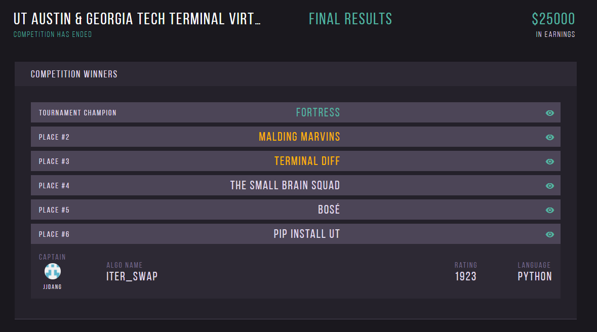

# Terminal Live 2020: UT Austin & Georgia Tech Virtual

### Introduction
PIP INSTALL UT is a team of 3 students from UT Austin and Georgia Tech who were chosen from a pool of more than 500
candidates to compete with 44 other teams to build an algorithm that would play head-to-head against other teams in a
unique digital board game. Learn more at [terminal.c1games.com/home](https://terminal.c1games.com/home).

### Placement
Our team placed 6/45, earning $1000 USD.

### Source Code
Out of respect for the integrity of the competition, we will not be publishing the source code we developed, even
though it used a unique game configuration.

### Round Robin match versus Terminal Season 6 Finalist

(it's a little bit confusing but our team's algorithm is in the top, colored red)

Super DC Buzz is a very competitive team that had months of experience with the game designing effective "algos" in
regular season competition. On the other hand, our team had no prior experience with Terminal.

We were very happy to have even outranked their team, by winning our round robin match against them which saw us place
6th and them place 8th in the competition.
